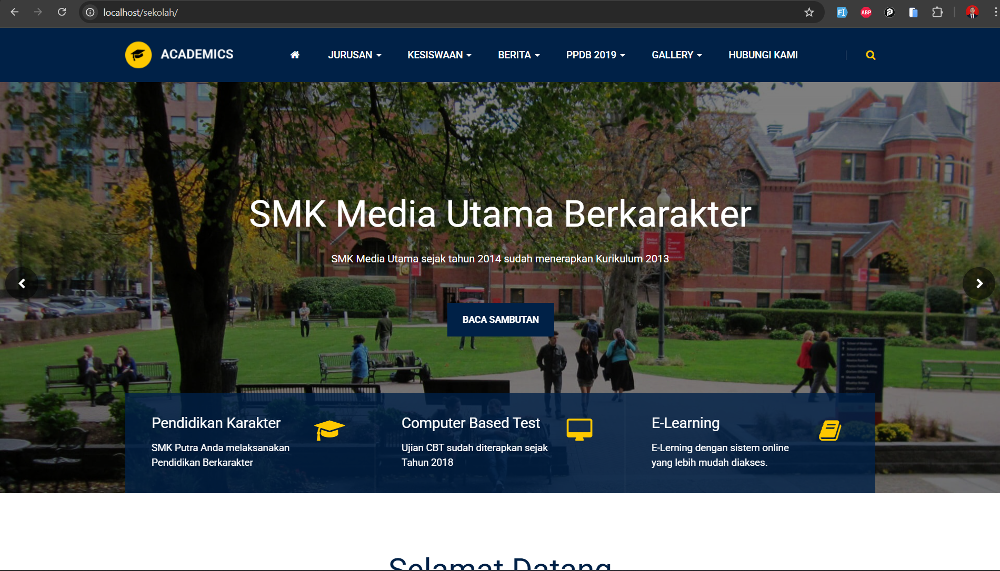

# APLIKASI WEBSITE SEKOLAH DAN PPDB ONLINE

## Screenshot Aplikasi



## Panduan Instalasi

1. Download dan Instal Aplikasi Xampp di Komputer (Mendukung PHP 8.0)
2. Ekstrak file menggunakan aplikasi WinRAR
3. Copy folder `sekolah` lalu paste ke folder `c:\xampp\htdocs\`
4. Aktifkan Apache dan MySQL pada Xampp
5. Buka browser, lalu buka alamat `localhost/phpMyAdmin`
6. Buat database baru dengan nama `sekolah` atau sesuaikan dengan kebutuhan
7. Import database aplikasi dari file `database/sekolah.sql` ke dalam database yang baru dibuat
8. Jalankan project dengan ketik `localhost/sekolah` di browser
9. Selesai

## Akses Login

### Jika menggunakan XAMPP (localhost)
```
URL: localhost/sekolah/login
Username: Admin
Password: 12345
```

### Jika menggunakan hosting
```
URL: websitemu.com/login
Username: Admin
Password: 12345
```

## Catatan untuk PHP 8.0

Aplikasi ini awalnya dikembangkan untuk PHP versi 7.x, namun telah diuji dan dapat berjalan pada PHP 8.0 dengan beberapa penyesuaian. Jika menemui error, silakan periksa error log dan lakukan penyesuaian pada kode yang diperlukan.

## Fitur Aplikasi

- Website Sekolah dengan tampilan modern
- Sistem PPDB (Penerimaan Peserta Didik Baru) Online
- Manajemen data guru dan siswa
- Manajemen konten website (berita, pengumuman, dll)
- Galeri foto dan video
- Dan masih banyak lagi

## Struktur Folder

- `application/` - Berisi kode aplikasi (controllers, models, views)
- `assets/` - Berisi file statis (CSS, JavaScript, gambar)
- `database/` - Berisi file SQL untuk database
- `system/` - Berisi framework CodeIgniter
- `media_library/` - Berisi file media yang diunggah

## Kontak

Jika ada pertanyaan atau kendala dalam penggunaan aplikasi ini, silakan hubungi pengembang.